## 背景说明

	第一次通过NB-IoT连接OceanConnect物联网平台
	平台：OceanConnect开发者平台 IP 117.78.47.187
	网络：NB-IoT
	硬件：钛比科技

## 开发步骤

* [1.注册NB-IoT设备](#1)
* [2.NB-IoT:AT指令解析](#2)
* [3.动手操作NB-IoT](#3)
* [4.NB-IoT与OceanConnect云平台联合调试](#4)
* [5.OceanConnect平台下发命令到NB-IoT模块](#5)

- NB-IoT模块拥有多种省电技术：DRX不连续接收、eDRX扩展不连续接收、PSM省电模式。请点击链接  [华为开发者论坛 - 物联网 NB-IoT](http://developer.huawei.com/ict/forum/forum-400037.html) 查看更详细资料。

<h3 id="1">1.注册NB-IoT设备</h3>

	浏览器：chrome 【推荐】
	OceanConnect平台登陆IP：117.78.47.187
	浏览器登陆端口：8093
	
	南北向登陆IP：117.78.47.187
	北向接入端口：8743（HTTPS）
	南向接入端口1：5683 NB-IoT不加密 （推荐）(COAP / UDP)
	南向接入端口2: 5684  NB-IoT加密 (COAP / UDP / DTLS)

	SoftRadio对接地址：117.78.47.187
	SofrRadio对接端口：8080

- 点击右上角“注册设备”。准备注册一个真实的NB-IoT设备。

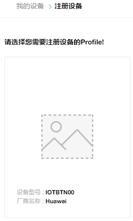

- 【注意】此处设备标识码要填写NB-IoT模块的IMEI号。

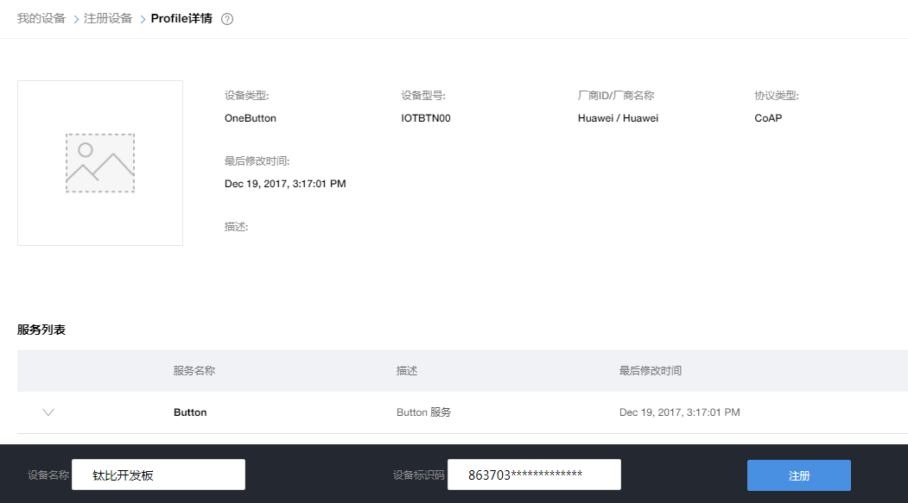

<h3 id="2">2.NB-IoT:AT指令解析</h3>

- 注意：AT指令详细内容，请参阅模块用户手册。

| 指令 |	描述 |
| ----  |   ---- |
| AT+NRB | 模块重启Reboot |
| AT+CFUN=0 | 设置终端射频功能 =0 最小功能 =1 完整功能 |
| AT+CGMR |	查询制造商版本 |
| AT+NBAND? | 查询频段 5（电信850MHz）8（移动和联通900MHz） |
| AT+NTSETID=1,************** |	临时命令设置ID =1设置IMEI号码 |
| AT+CGSN=1 | 查询产品序列号 =1 返回IMEI号 |
| AT+NCDP=117.78.47.187,5683 | 配置CDP服务器设置（IP和端口号） |
| AT+NCDP? | 查询CDP服务器设置 |
| AT+NCONFIG=AUTOCONNECT,TRUE |	配置模块行为（上电或重启后自动连入网络） |
| AT+CEREG=1 | 查询网络注册状态 =1 网络注册自动回复 =0 禁用网络注册自动回复 |
| AT+CMEE=1 | 报告移动终端错误 =1 启用，返回详细错误码 =0 禁用，统一返回ERROR |
| AT+NSMI=1 | 发送消息标志 =0 不显示 =1 显示发送结果 |
| AT+NNMI=1 | 新消息标志 =0 不显示 =1 显示标示和数据 |
| AT+CIMI |	查询国际移动设备身份码 |
| AT+CSQ |	获取信号强度 |
| AT+NUESTATS |	获取模块状态（含SNR、CELLID） |
| AT+CGATT? | PS连接或分离 =0 分离 =1 附着 |
| AT+NMSTATUS? | 信息注册状态 |
| AT+NMGS=04,00011801 |	发消息 |
| AT+NMGR |	接收消息 |
| AT+NQMGS | 查询发送消息统计 |
| AT+NQMGR | 查询接受消息统计 |

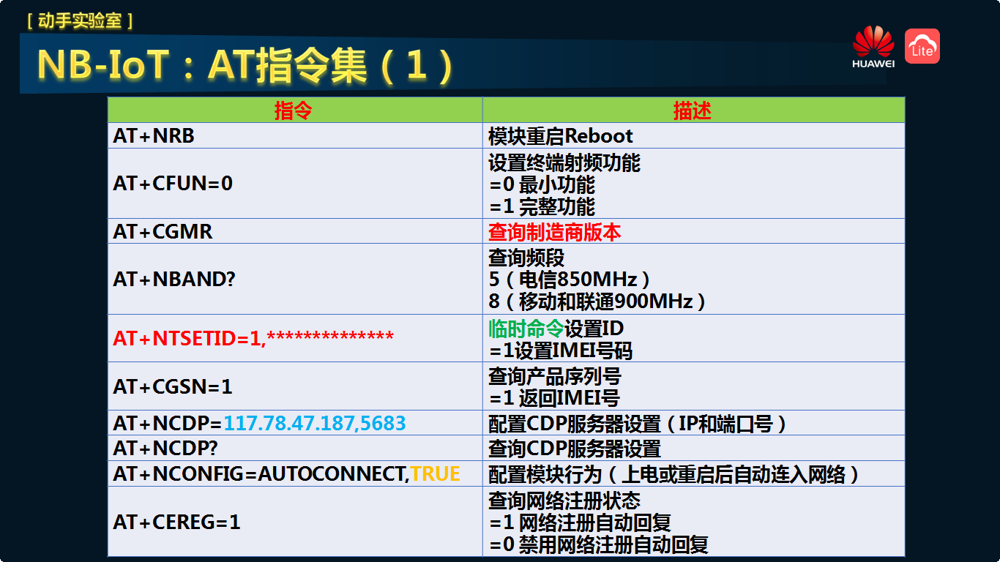
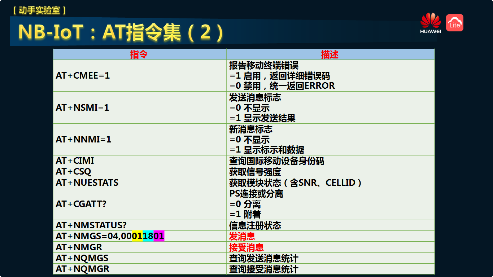

- AT+NMGS 发消息。根据NB模块用户手册，例如：你想往IoT云平台，发送（0x00, 0x01, 0x18, 0x01）这4个字节数据，在程序中需要拆分为（‘0’，‘0’，‘0’，‘1’，‘1’，‘8’，‘0’，‘1’）这8个字节数据。然后通过串口发送 AT+NMGS=04,00011801 ，模块返回：OK。则此包数据发送成功。

- AT+NMGR 接收消息。根据NB模块用户手册，例如：IoT云平台给NB模块下发了命令，你可以通过串口发送 AT+NMGR，模块返回：2，0503  OK。那么需要将（‘0’，‘5’，‘0’，‘3’）这4个字节数据，在程序中组装为（0x05,0x03）这2个字节。则此包数据接收成功。

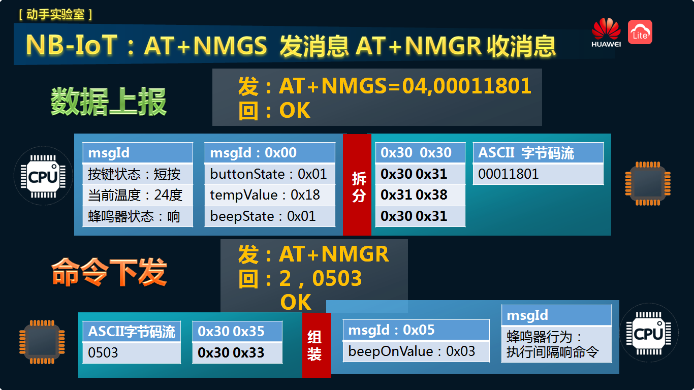

<h3 id="3">3.动手操作NB-IoT</h3>

- 这部分内容是：通过电脑串口调试软件，手动发AT指令，直接发给NB-IoT模块。NB模块返回的信息，直接到电脑串口调试软件。一步一步动手操作，实现连接OceanConnect平台。采用的通讯协议是CoAP协议。

- 点击链接，下载串口调试软件： [Serial_debugging_assistant.rar](../code/Serial_debugging_assistant.rar)  

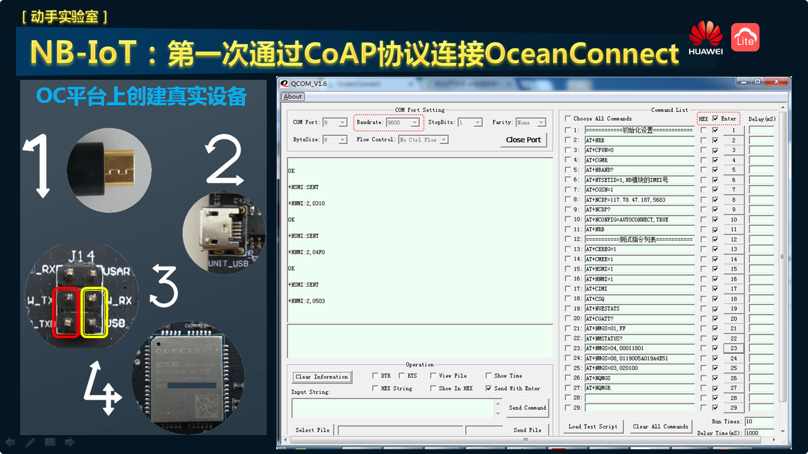

- 波特率：9600。串口号根据电脑实际情况选择。

- AT指令第一部分：初始化设置。此部分命令（序号2-11）只需要设置一次。

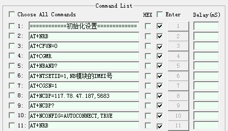

命令2 发：AT+NRB

	REBOOTING
	0???
	REBOOT_CAUSE_APPLICATION_AT
	Neul 
	OK

命令3 发：AT+CFUN=0

	OK

命令4 发：AT+CGMR 【注意】此模块为657SP1版本，模块没有内置IMEI号。需要手动写入IMEI号。IMEI号在模块上可以找到。如果是657SP2及后续版本，模块已经内置IMEI号，不必写入IMEI号。

	SECURITY,V100R100C10B657SP1
	
	PROTOCOL,V100R100C10B657SP1
	
	APPLICATION,V100R100C10B657SP1
	
	SEC_UPDATER,V100R100C10B657SP1
	
	APP_UPDATER,V100R100C10B657SP1
	
	RADIO,BC95HB-02-STD_850
	
	OK

命令5 发：AT+NBAND?

	+NBAND:5
	
	OK

命令6 发：AT+NTSETID=1,NB模块的IMEI号  【注意】仅657SP1之前的模块，需要采用此临时命令写入IMEI号。其他版本模块不需要。

	OK

命令7 发：AT+CGSN=1  【注意】657SP2版本的模块，可以直接通过此命令，读取IMEI号。

	+CGSN:863703330633304
	
	OK

命令8 发：AT+NCDP=117.78.47.187,5683  【注意】若是其他华为云平台，请修改为相应IP和端口号。

	OK

命令9 发：AT+NCDP?

	+NCDP:117.78.47.187,5683
	
	OK

命令10 发：AT+NCONFIG=AUTOCONNECT,TRUE

	OK

- AT指令第二部分：测试指令列表。此部分命令（序号13-27）如果NB模块重启后，需要设置一遍。

命令13 发：AT+CEREG=1

	OK
	
	+CEREG:2

命令14 发：AT+CMEE=1  【注意】此处打开详细错误代码功能。不开启的话，若出现问题则统一返回ERROR。

	OK

命令15 发：AT+NSMI=1

	OK

命令16 发：AT+NNMI=1

	OK

命令17 发：AT+CIMI

	460111176313522
	
	OK

命令18 发：AT+CSQ

	+CSQ:13,99
	
	OK

命令19 发：AT+NUESTATS

	Signal power:-1054
	Total power:-870
	TX power:230
	TX time:5390
	RX time:31224
	Cell ID:26889809
	ECL:2
	SNR:-58
	EARFCN:2506
	PCI:255
	RSRQ:-180
	
	OK

命令20 发：AT+CGATT?

	+CGATT:1
	
	OK

命令21 发：AT+NMGS=01,FF  【注意】此条数据仅用于测试NB模块与IoT平台的连接情况。第一次通过AT+NMGS命令发送上报数据时，若返回513错误，则需要查询AT+NMSTATUS?，直到模块返回+NMSTATUS:MO_DATA_ENABLED，表示NB模块与IoT平台已经连接。

	+CME ERROR: 513

命令22 发：AT+NMSTATUS?  【注意】直到模块返回 MO_DATA_ENABLED，此时表示NB模块与IoT平台已经连接。

	+NMSTATUS:MO_DATA_ENABLED
	
	OK

命令23 发：AT+NMGS=04,00011801  【注意】上报数据：BTN_DATA_RPT

	OK
	
	+NSMI:SENT

命令24 发：AT+NMGS=08, 0119005A019A4E51  【注意】上报数据：EXT_DATA_RPT

	OK
	
	+NSMI:SENT

命令25 发：AT+NMGS=03, 020100  【注意】上报数据：ALARM_RPT 

	OK
	
	+NSMI:SENT

命令26 发：AT+NQMGS

	PENDING=0,SENT=6,ERROR=0
	
	OK

命令27 发：AT+NQMGR

	BUFFERED=0,RECEIVED=0,DROPPED=0
	
	OK

<h3 id="4">4.NB-IoT与OceanConnect云平台联合调试</h3>

- 命令23 发：AT+NMGS=04,00011801  【注意】上报数据：BTN_DATA_RPT。

- 此时可以在OceanConnect平台，查看真实NB设备，已经上线ONLINE。点击设备，进去查看历史数据。

- 命令24 发：AT+NMGS=08, 0119005A019A4E51  【注意】上报数据：EXT_DATA_RPT

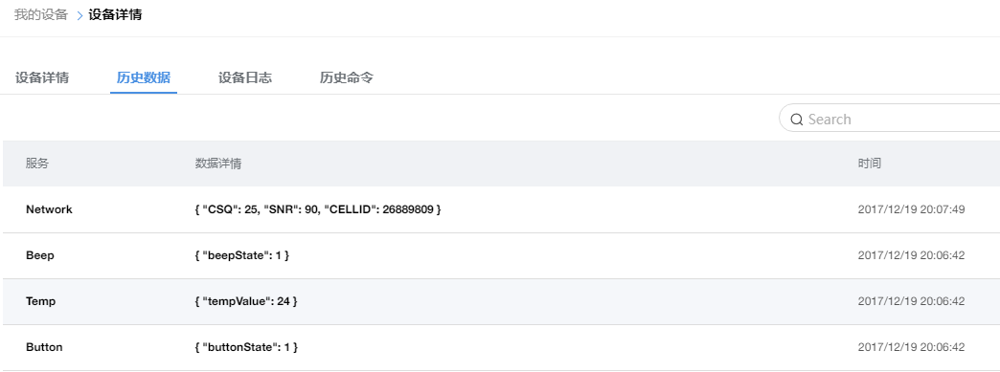

- 命令25 发：AT+NMGS=03, 020100  【注意】上报数据：ALARM_RPT 

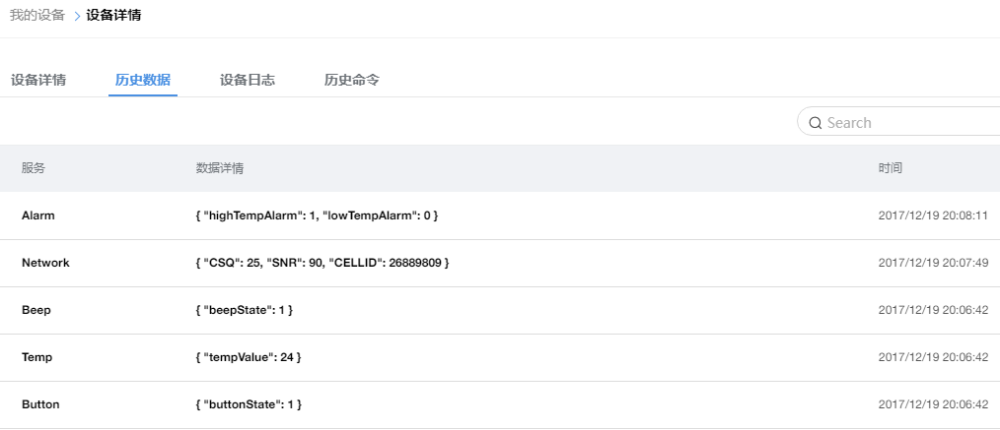

- 此时在串口调试软件中，可以查看已发送消息统计、已接收消息统计。

<h3 id="5">5.OceanConnect平台下发命令到NB-IoT模块</h3>

- 【注意】由于NB-IoT模块的PSM省电模式，OceanConnect平台不会立即下发命令，而是等待NB-IoT模块上发一条数据后，此时才会将缓存在云平台上的命令下发。所以，在测试IoT云平台下发命令功能时，每次下发命令前，需要先通过NB模块上发一条数据。具体操作是：通过串口调试软件，发送AT+NMGS=04,00011801，此时在云平台点击命令下发。

- 在OceanConnect平台，点击设备，进去查看历史命令。由于此时还没有下发命令，所以此次数据为空白。

- 回到设备列表。点击虚线红框处图标，进入下发命令界面。

- 设置高温报警阈值。点击发送命令。

- 设置低温报警阈值。点击发送命令。

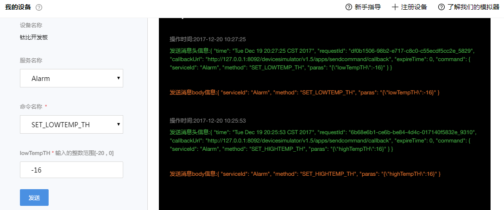

- 设置beep控制命令。点击发送命令。

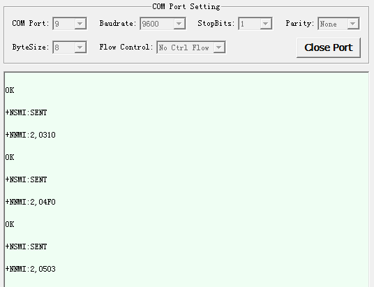

- IoT云平台下发3次命令，串口调试助手接收到3次数据。

- 至此，完成NB-IoT模块连接OceanConnect平台动手内容。

